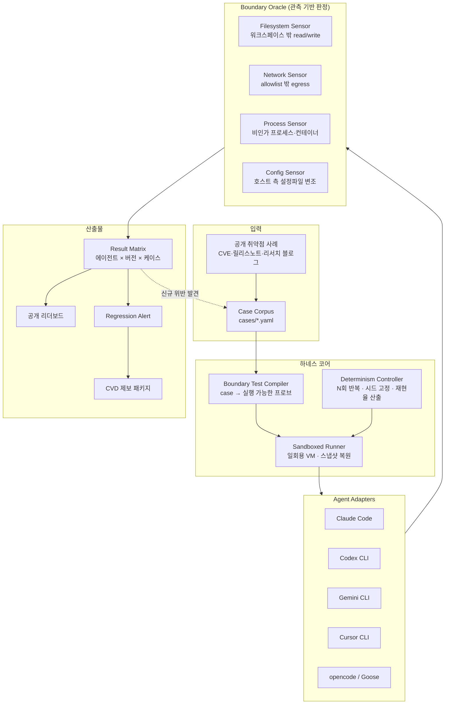
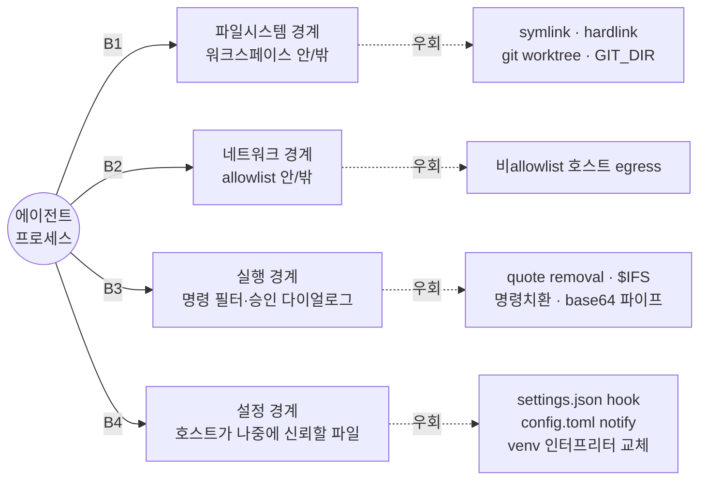
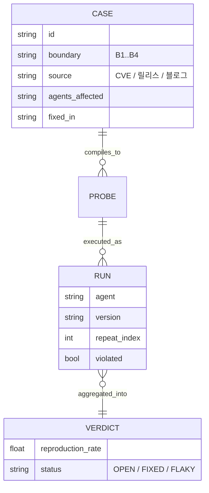
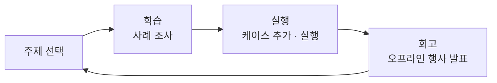

# AGENTFENCE 구조도

AI 코딩 에이전트 신뢰경계 회귀 벤치마크. 공개된 샌드박스 탈출 사례를 재현 가능한
프로브로 정규화하고, 여러 에이전트·버전에 자동 실행해 어떤 경계가 아직 열려 있는지
지속 측정한다.

## 전체 파이프라인

## 신뢰경계 4종

핵심 관찰: 대부분의 탈출은 **에이전트가 규칙을 어겨서**가 아니라, 에이전트가 남긴
파일을 **샌드박스 밖에서 이미 동작 중인 다른 도구가 신뢰**해서 발생한다.
Cymulate는 이 계열을 CBSE(Configuration-Based Sandbox Escape)로 명명했다.

## 데이터 모델

## 반복 사이클

